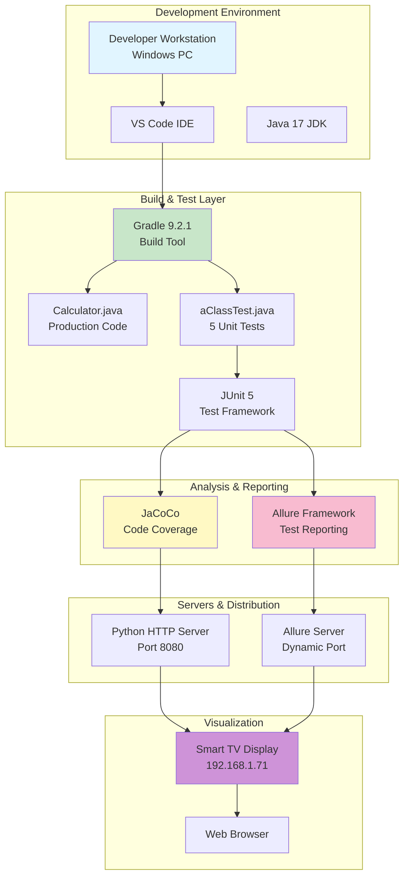
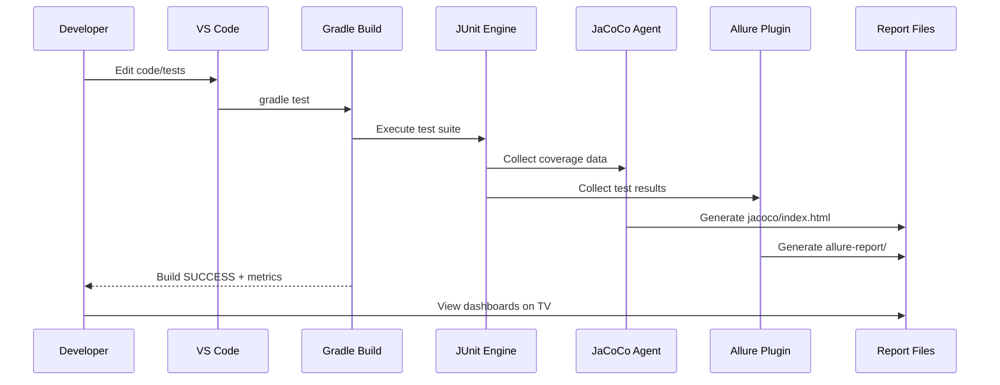
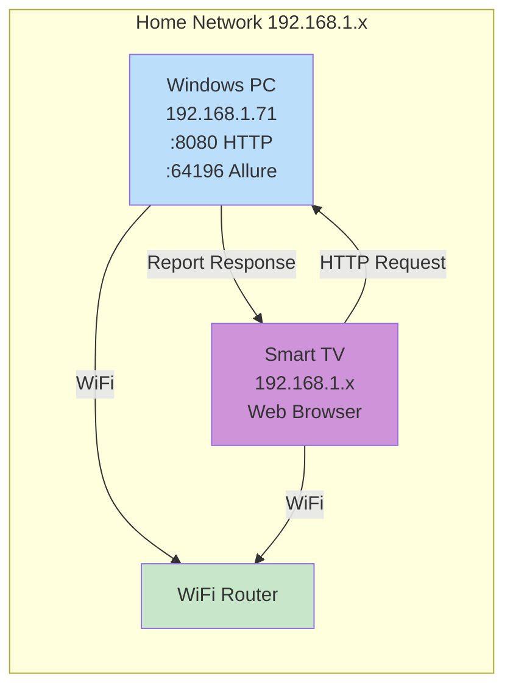
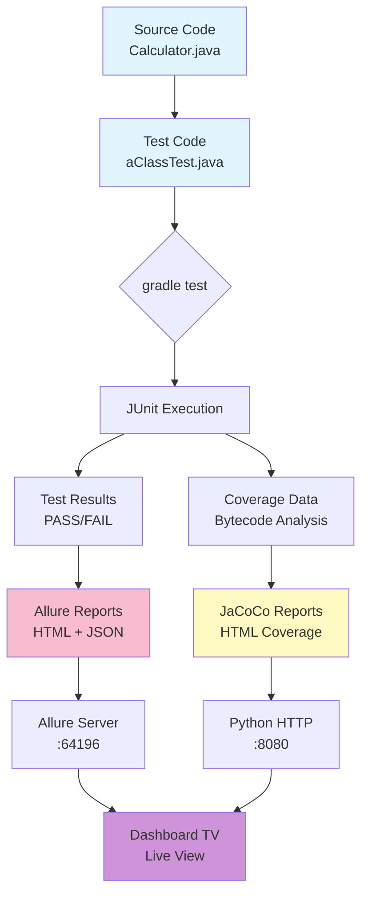

# 🏗️ System Architecture - Week 1

[🏠 Home](../Home.md) > [Architecture](./System-Architecture.md) > System Architecture

← [Home](../Home.md)

---

**Last Updated:** December 13, 2025  
**Status:** Foundation Complete ✅

---

## Overview

This document describes the Test Center of Excellence (TCOE) architecture established in Week 1. The system provides automated testing, code coverage tracking, and live dashboard reporting capabilities.

---

## High-Level Architecture



---

## Component Details

| Component | Version | Purpose | Configuration |
|-----------|---------|---------|---------------|
| **Java JDK** | 17 (Temurin) | Runtime environment | JAVA_HOME set, PATH configured |
| **Gradle** | 9.2.1 | Build automation | Configuration cache enabled (disabled for Allure) |
| **JUnit Jupiter** | 5.10.0 | Test framework | Platform launcher included |
| **JaCoCo** | 0.8.11 | Code coverage | Auto-generates HTML reports to absolute paths |
| **Allure** | 2.24.1 | Test reporting | Full annotation support (@Epic/@Feature/@Story/@Severity) |
| **Python HTTP** | 3.x | Static file server | Port 8080, serves JaCoCo reports |
| **Allure Server** | Built-in | Dynamic report server | Auto-assigns ports (e.g., 64196) |

---

## Test Execution Flow



---

## Network Architecture



**Access URLs:**
- JaCoCo: `http://192.168.1.71:8080/jacoco/index.html`
- Allure: `http://192.168.1.71:64196` (port varies)

---

## Data Flow



---

## File Structure

```
C:\AutomationProject\java\
├── app\
│   ├── src\
│   │   ├── main\java\aClass\
│   │   │   └── Calculator.java          # Production code
│   │   └── test\java\aClass\
│   │       └── aClassTest.java          # Test suite (5 tests)
│   └── build\
│       ├── jacoco\                      # Coverage HTML reports
│       └── allure-report\               # Test result HTML reports
├── gradle\                              # Gradle wrapper
├── docs\
│   ├── Home.md                          # Navigation portal
│   ├── architecture\
│   │   └── System-Architecture.md       # This file
│   ├── getting-started\                 # Setup guides
│   ├── metrics-reports\                 # KPI documentation
│   ├── roadmap\                         # Weekly plans
│   ├── runbooks\                        # Operations guides
│   └── troubleshooting\                 # Issue resolution
├── TCOE-Metrics.md                      # Daily metrics log
├── build.gradle                         # Build configuration
└── settings.gradle                      # Project settings
```

---

## Technology Decisions

### Why JaCoCo?
- **Industry Standard:** Used by 70%+ of Java projects
- **Gradle Integration:** Native plugin support
- **Zero Configuration:** Works out-of-the-box
- **HTML Reports:** No additional tools needed for visualization

### Why Allure?
- **Enterprise Grade:** Used by Spotify, LinkedIn, etc.
- **Rich Annotations:** Epic/Feature/Story organization
- **Beautiful UI:** Professional-looking reports
- **CI/CD Ready:** Jenkins, GitHub Actions integration

### Why Python HTTP Server?
- **Simplicity:** One-line command to start
- **Cross-Platform:** Works on Windows/Mac/Linux
- **Lightweight:** No installation needed (bundled with Python)
- **Sufficient:** Perfect for serving static HTML files

### Why Markdown Documentation?
- **Human Readable:** Easy to read/edit in plain text
- **Version Control:** Git-friendly text format
- **Platform Independent:** Works everywhere
- **VS Code Support:** Built-in preview with Mermaid diagrams

---

## Current Metrics (Week 1 Day 1)

| Metric | Value | Target | Status |
|--------|-------|--------|--------|
| **Test Count** | 5 | 10+ | 🟡 50% |
| **Code Coverage** | 100% | 80%+ | ✅ Exceeded |
| **Build Time** | ~5s | <10s | ✅ Excellent |
| **Test Pass Rate** | 100% | 95%+ | ✅ Perfect |
| **Server Uptime** | 100% | 99%+ | ✅ Stable |
| **Dashboard Availability** | 100% | 95%+ | ✅ Accessible |

---

## Future Enhancements

### Week 2-4: Integration Testing
- Add Selenium WebDriver for UI tests
- Configure TestNG data providers
- Implement Page Object Model

### Week 5-8: CI/CD Pipeline
- GitHub Actions workflow
- Automated test execution on commits
- Slack notifications

### Week 9-12: Advanced Reporting
- Extent Reports integration
- TestRail integration
- Custom metrics dashboard

### Week 13-16: Performance Testing
- JMeter integration
- Load testing scenarios
- Performance metrics tracking

### Week 17-20: Final Optimization
- Test parallelization
- Cloud execution (Selenium Grid)
- Final documentation polish

---

## References

- [Home.md](../Home.md) - Documentation portal
- [TCOE-Metrics.md](../../TCOE-Metrics.md) - Daily metrics log
- [build.gradle](../../build.gradle) - Build configuration
- [JaCoCo Dashboard](http://192.168.1.71:8080/jacoco/index.html)
- [Allure Reports](http://192.168.1.71:64196)

---

**Document Status:** ✅ Complete  
**Review Date:** Week 2 Day 1  
**Owner:** TCOE Team