# ▶️ Running Tests Guide

[🏠 Home](../Home.md) > [Getting Started](./Environment-Setup.md) > Running Tests

← [Previous: Installation](Environment-Setup.md) | [Next: FAQ →](FAQ.md)

---

**Last Updated:** December 13, 2025  
**Difficulty:** Beginner

---

## Overview

This guide explains how to run tests, generate reports, and view results in the TCOE framework. Whether you're running a single test or the entire suite, you'll find the commands and workflows here.

---

## Quick Start

### Run All Tests

```powershell
gradle test
```

**Output:**
```
> Task :app:test

aClassTest > addPositiveNumbers() PASSED
aClassTest > addNegativeNumbers() PASSED
aClassTest > addZero() PASSED
aClassTest > subtractNumbers() PASSED
aClassTest > subtractResultingInNegative() PASSED

BUILD SUCCESSFUL in 3s
5 tests, 5 passed
```

---

## Running Tests in VS Code

### Method 1: Test Explorer

1. Click the **Testing** icon in left sidebar (flask icon)
2. Expand test tree:
   ```
   📦 aClass
   └── 📄 aClassTest
       ├── ✅ addPositiveNumbers
       ├── ✅ addNegativeNumbers
       ├── ✅ addZero
       ├── ✅ subtractNumbers
       └── ✅ subtractResultingInNegative
   ```
3. **Run single test:** Click ▶️ icon next to test name
4. **Run all tests:** Click ▶️ icon next to class name
5. **Debug test:** Click 🐞 icon (sets breakpoints)

### Method 2: Code Editor

1. Open [aClassTest.java](../../app/src/test/java/aClass/aClassTest.java)
2. Look for **Run | Debug** links above each `@Test` method
3. Click **Run** to execute single test
4. Results appear in Output panel

### Method 3: Keyboard Shortcut

- **Run test at cursor:** `Ctrl+F5` (without debugging)
- **Debug test at cursor:** `F5` (with breakpoints)

---

## Running Tests from Terminal

### Basic Commands

```powershell
# Run all tests
gradle test

# Clean and run tests
gradle clean test

# Run tests with detailed output
gradle test --info

# Run tests and generate reports
gradle test jacocoTestReport
```

### Run Specific Test Class

```powershell
gradle test --tests "aClass.aClassTest"
```

### Run Specific Test Method

```powershell
gradle test --tests "aClass.aClassTest.addPositiveNumbers"
```

### Run Tests with Pattern Matching

```powershell
# Run all tests with "add" in name
gradle test --tests "*add*"

# Run all tests in aClass package
gradle test --tests "aClass.*"
```

---

## Running Tests by Tags

### View Available Tags

Current tags in aClassTest:
- `@Tag("critical")` - Pre-release critical tests
- `@Tag("unit")` - Unit tests

### Run Tagged Tests

```powershell
# Run only critical tests
gradle test -Dtags="critical"

# Run multiple tags
gradle test -Dtags="critical | unit"

# Exclude tags
gradle test -Dtags="!integration"
```

**Gradle Configuration (already in build.gradle):**
```gradle
test {
    useJUnitPlatform {
        if (System.getProperty('tags')) {
            includeTags System.getProperty('tags')
        }
    }
}
```

---

## Generating Reports

### JaCoCo Code Coverage Report

```powershell
# Generate coverage report
gradle jacocoTestReport
```

**Report Location:**
```
C:\AutomationProject\java\app\build\jacoco\index.html
```

**Auto-Generation:**
Tests automatically generate JaCoCo reports due to this configuration:
```gradle
test {
    finalizedBy jacocoTestReport
}
```

### Allure Test Report

```powershell
# Generate Allure report (static)
gradle allureReport --no-configuration-cache
```

**Report Location:**
```
C:\AutomationProject\java\app\build\allure-report\index.html
```

### Serve Reports Live

#### JaCoCo (Python HTTP Server)

```powershell
cd C:\AutomationProject\java\app\build
python -m http.server 8080
```

**Access:** `http://localhost:8080/jacoco/index.html`

#### Allure (Built-in Server)

```powershell
gradle allureServe --no-configuration-cache
```

**Access:** Browser opens automatically (e.g., `http://localhost:64196`)

---

## Understanding Test Results

### Console Output

```
> Task :app:test

aClassTest > addPositiveNumbers() PASSED (0.1s)
aClassTest > addNegativeNumbers() PASSED (0.0s)
aClassTest > addZero() PASSED (0.0s)
aClassTest > subtractNumbers() PASSED (0.0s)
aClassTest > subtractResultingInNegative() PASSED (0.0s)

BUILD SUCCESSFUL in 3s
5 tests completed, 5 passed
```

**Metrics Breakdown:**
- ✅ `PASSED` - Test executed successfully
- ⏱️ `(0.1s)` - Execution time
- `5 tests completed` - Total tests run
- `5 passed` - Success count

### Test Failure Output

**Example:**
```
aClassTest > addPositiveNumbers() FAILED
    org.opentest4j.AssertionFailedError: expected: <5> but was: <4>
        at aClass.aClassTest.addPositiveNumbers(aClassTest.java:25)

1 test completed, 1 failed
```

**Failure Details:**
- ❌ `FAILED` - Test assertion failed
- **Expected vs Actual:** `expected: <5> but was: <4>`
- **File Location:** `aClassTest.java:25`
- **Action:** Click link to jump to failing line

---

## Viewing Test Reports

### JaCoCo Coverage Report

**What You'll See:**
- 📊 Overall coverage percentage (currently 100%)
- 📦 Package-level coverage breakdown
- 📄 Class-level detailed view
- 🔍 Line-by-line coverage (green = covered, red = missed)

**Key Metrics:**
- **Instruction Coverage:** Bytecode instruction coverage
- **Branch Coverage:** Conditional statement coverage (if/else)
- **Line Coverage:** Source code line coverage
- **Complexity:** Cyclomatic complexity

**Color Coding:**
- 🟢 **Green:** Covered code
- 🔴 **Red:** Uncovered code
- 🟡 **Yellow:** Partially covered branches

### Allure Report

**Sections:**
1. **Overview**
   - Total tests: 5
   - Pass rate: 100%
   - Execution time: ~3s

2. **Suites**
   - Test classes and methods
   - Execution timeline

3. **Graphs**
   - Test duration trend
   - Severity distribution
   - Feature coverage

4. **Categories**
   - Epic: Calculator Functionality
   - Features: Basic Arithmetic
   - Stories: Addition, Subtraction

**Allure Annotations:**
```java
@Epic("Calculator Functionality")      // High-level feature
@Feature("Basic Arithmetic")           // Sub-feature
@Story("Addition")                     // User story
@Severity(SeverityLevel.CRITICAL)      // Priority
@Description("Verifies 2+3=5")         // Details
```

---

## Test Execution Workflow

```mermaid
flowchart TD
    A[Write/Modify Test] --> B[Save File]
    B --> C{Run via?}
    C -->|VS Code| D[Click Run Icon]
    C -->|Terminal| E[gradle test]
    D --> F[JUnit Executes Tests]
    E --> F
    F --> G[JaCoCo Collects Coverage]
    F --> H[Allure Collects Results]
    G --> I[Generate jacoco/index.html]
    H --> J[Generate allure-report/]
    I --> K[View in Browser]
    J --> K
    K --> L{Pass?}
    L -->|Yes| M[Commit Code ✅]
    L -->|No| N[Fix Test/Code]
    N --> A

    style F fill:#c8e6c9
    style I fill:#fff9c4
    style J fill:#f8bbd0
    style M fill:#a5d6a7
```



---

## Best Practices

### Before Running Tests

✅ **Do:**
- Save all open files (Ctrl+Shift+S)
- Close unnecessary applications
- Ensure no compilation errors

❌ **Don't:**
- Run tests with unsaved changes
- Have multiple Gradle builds running simultaneously
- Modify code while tests are executing

### After Running Tests

✅ **Do:**
- Check test output for failures
- Review coverage reports (aim for 80%+)
- Update TCOE-Metrics.md with results
- Commit passing tests to Git (Week 2+)

❌ **Don't:**
- Ignore failing tests
- Skip coverage verification
- Commit code with failing tests

### Performance Tips

**Faster Test Execution:**
```powershell
# Enable Gradle daemon (already default in 9.2.1)
gradle test --daemon

# Parallel execution (for large suites)
gradle test --parallel --max-workers=4

# Skip unchanged tests
gradle test --continuous
```

---

## Troubleshooting

### Tests Not Running

**Symptom:** `No tests found`

**Solutions:**
1. Verify test class has `@Test` annotations
2. Check test class is in correct package: `app/src/test/java/`
3. Rebuild project: `gradle clean build`

### Coverage Report Not Generated

**Symptom:** `jacoco/index.html` not found

**Solutions:**
```powershell
# Force regenerate
gradle clean test jacocoTestReport

# Check build output
gradle test --info
```

### Allure Report Shows "Loading..."

**Symptom:** Allure opens but shows spinner

**Solutions:**
1. **Don't use file:// protocol** - Use Allure server:
   ```powershell
   gradle allureServe --no-configuration-cache
   ```
2. If server fails, check port conflicts

### Test Hangs Indefinitely

**Symptom:** Test never completes

**Solutions:**
1. Press `Ctrl+C` in terminal to cancel
2. Kill Gradle daemon:
   ```powershell
   gradle --stop
   ```
3. Restart VS Code

---

## Keyboard Shortcuts Reference

| Action | Windows Shortcut |
|--------|-----------------|
| Run test at cursor | `Ctrl+F5` |
| Debug test at cursor | `F5` |
| Run last test | `Shift+F5` |
| Open Test Explorer | `Ctrl+Shift+T` |
| Toggle terminal | `Ctrl+`` |
| Stop running tests | `Ctrl+C` (in terminal) |

---

## Network Access

### View Dashboards on TV/Other Devices

**Find Your IP:**
```powershell
ipconfig | Select-String "IPv4"
```

**Access URLs from TV:**
- JaCoCo: `http://192.168.1.71:8080/jacoco/index.html`
- Allure: `http://192.168.1.71:<port>` (check terminal for port)

**Requirements:**
- PC and TV on same WiFi network
- Python HTTP server running (JaCoCo)
- Allure server running (Allure)

---

## Metrics to Track

After each test run, update [TCOE-Metrics.md](../../TCOE-Metrics.md):

**Daily Metrics:**
- ✅ Total tests executed
- ✅ Pass/Fail count
- ✅ Code coverage %
- ✅ Build time
- ✅ New tests added
- ✅ Bugs found

**Example Entry:**
```markdown
| Dec 13 | 5 | 5 | 0 | 100% | 3s | 5 | 0 |
```

---

## Next Steps

- Read [FAQ](FAQ.md) for common questions
- Learn [System Architecture](../architecture/System-Architecture.md)
- Check [Troubleshooting Guide](../troubleshooting/Common-Issues.md)
- Review [Daily Operations Runbook](../runbooks/Daily-Operations.md)

---

**Document Status:** ✅ Complete  
**Last Reviewed:** December 13, 2025  
**Maintainer:** TCOE Team